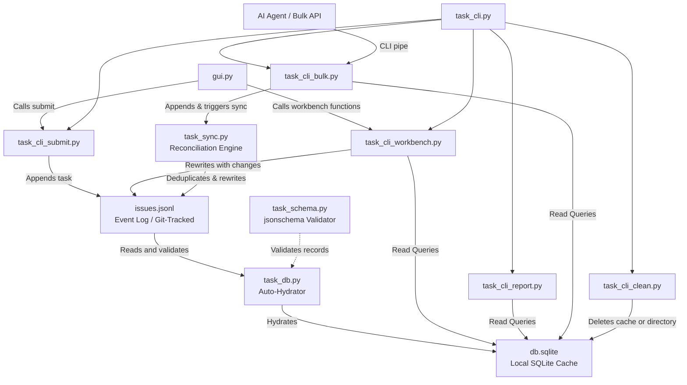

# LeanTask Technical Documentation

This document explains the internal mechanics, architecture, theory of operation, and codebase structure of the **LeanTask** distributed task management system.

---

## 1. System Architecture

LeanTask is built on a hybrid architecture combining an **append-only event log (source of truth)**, a **lazy-loading SQLite cache (query optimization)**, and **Git union merge conflict resolution (collaboration)**.

### Architecture & Data Flow Diagram



---

## 2. Theory of Operation

### Event-Sourced Append-Only JSONL Storage
The primary database is `.tasks/issues.jsonl`, a plain text JSON Lines file. 
- **Why JSONL?** Git struggles to merge binary files (like SQLite database files) or complex multi-line structures (like formatted JSON files). JSONL contains one complete JSON object per line. When two Git branches append new lines, Git can automatically merge them without conflict using standard line-based diff tools.
- **Append and Mutate Cycles**:
  - **Tier 1 (Submit)**: Simply appends a new JSON line to the end of the file in `<15ms`.
  - **Tier 2 (Workbench/GUI edits)**: Updates are state-mutating events. The workbench parses the file, finds the matching record, applies mutations (adding audit records to the `history` field and updating `updated_at`), and rewrites the file.
  - **Tier 3/Bulk (Import & Sync)**: When bulk importing, updated task lines are appended directly to the end of the file, temporarily creating duplicates. The sync engine is then run to consolidate duplicate `task_id` entries.

### SQLite Auto-Hydration & Caching (`task_db.py`)
To prevent parsing the entire JSONL file on every search or query, LeanTask uses a local SQLite cache at `.tasks/db.sqlite`.
1. **Lazy Validation Checks**: Every call to [get_connection()](task_db.py#L149) triggers a verification step:
   - It retrieves the modification timestamp (`mtime`) of `issues.jsonl` and `db.sqlite`.
   - If `issues.jsonl` has a newer timestamp than `db.sqlite` (or if the database does not exist), the system rebuilds the database from scratch.
2. **Rebuild Steps**:
   - The database file tables are dropped and recreated.
   - The system reads `issues.jsonl` line by line.
   - Each line is deserialized and validated against the JSON Schema in [task_schema.py](task_schema.py). Invalid records are skipped and logged.
   - Valid records are inserted or replaced into the `tasks`, `task_history`, and `task_comments` SQLite tables.
   - Indexes on frequently searched columns (`status`, `project`) are built to guarantee quick query retrieval.

### Git Union Merging
The `.gitattributes` file in the root of the project contains:
```gitattributes
.tasks/issues.jsonl merge=union
```
This forces Git to use the `union` merge driver whenever merging branches. Instead of failing with a merge conflict when two different branches modify `.tasks/issues.jsonl`, Git merges the files by taking lines from both branches and placing them together. 

While this avoids manual Git merge conflicts, it will result in duplicate rows with identical `task_id`s in `issues.jsonl`. This is resolved by the deterministic synchronization engine.

### Conflict Resolution Engine (`task_sync.py`)
When `sync_issues()` is run, LeanTask collapses duplicate task records in `issues.jsonl` into a single, canonical task object using deterministic rules:

1. **Timestamp Dominance (Last-Write-Wins)**:
   By default, task fields (e.g. `title`, `description`, `project`, `priority_score`, `due_date`) adopt the values of the task instance with the newest `updated_at` ISO-8601 timestamp.
2. **Status Precedence Override**:
   To prevent regressions (such as an old, stale `open` status overriding a newer `closed` status due to clock drift or offline lag), LeanTask enforces a strict status rank:
   $$\text{closed (60)} > \text{review (50)} > \text{in\_progress (40)} > \text{blocked (30)} > \text{open (20)} > \text{deferred (10)}$$
   The status with the higher precedence rank is chosen, regardless of which record is newer.
3. **Array Unions**:
   - **Tags**: Combined and deduplicated: $\text{tags} = \text{tags}_1 \cup \text{tags}_2$.
   - **Blocked By**: Combined and deduplicated: $\text{blocked\_by} = \text{blocked\_by}_1 \cup \text{blocked\_by}_2$.
4. **Log Merging**:
   - **Comments**: Merged and deduplicated by their unique `comment_id`, then sorted chronologically by their `timestamp`.
   - **History**: Deduplicated by content (serialized JSON equivalence) and sorted chronologically.

---

## 3. Codebase Structure

The project code is divided into functional components as follows:

| Module / File | Core Responsibility | Public APIs / Interface |
| :--- | :--- | :--- |
| **[task_cli.py](task_cli.py)** | Main Entry Point. Parses CLI flags and dispatches arguments to sub-modules. | `main()` |
| **[task_cli_submit.py](task_cli_submit.py)** | Submits new raw tasks. Fast offline append with randomized `task_id` creation. | [submit(raw_string)](task_cli_submit.py#L8) |
| **[task_cli_workbench.py](task_cli_workbench.py)** | Handles task mutations (descriptions, due dates, statuses, tags, comments, priorities) and views, including due-date normalization to `YYYY-MM-DD`. | `search()`, `comment()`, `due()`, `list_tasks()`, `view()`, `state()`, `priority()`, `project()`, `title()`, `description()`, `tags()`, `blocked_by()` |
| **[task_cli_report.py](task_cli_report.py)** | Computes task blocker hierarchies and urgency levels to output a daily Markdown report. | [report()](task_cli_report.py#L4) |
| **[task_cli_bulk.py](task_cli_bulk.py)** | Formats bulk tasks to `stdout` as JSON arrays or imports tasks from `stdin`/file. | [export_tasks(status=None)](task_cli_bulk.py#L9), [import_tasks(file_path=None)](task_cli_bulk.py#L66) |
| **[task_cli_clean.py](task_cli_clean.py)** | Manages database cache cleanup. Support soft cache wipes and hard logs resets. | [clean(hard=False)](task_cli_clean.py#L5) |
| **[task_db.py](task_db.py)** | Database initialization, schema definition, auto-hydration logic, and SQLite accessors. | [get_connection()](task_db.py#L149), [hydrate_if_needed()](task_db.py#L131) |
| **[task_schema.py](task_schema.py)** | JSON Schema validation rules. Ensures data integrity before SQLite inserts. | [validate_task(task_obj)](task_schema.py#L94) |
| **[task_sync.py](task_sync.py)** | Event reconciliation, last-write-wins merging, and status precedence resolution rules. | [sync_issues()](task_sync.py#L47), [merge_tasks(t1, t2)](task_sync.py#L15) |
| **[gui.py](gui.py)** | Desktop graphical user interface built with CustomTkinter for visualization and management. | `TaskManagerApp` |

---

## 4. SQLite Schema Details

The SQLite cache consists of three tables, defined in [task_db.py](task_db.py):

### 1. `tasks` Table
Stores the flattened current state of all tasks.
- `task_id` (TEXT PRIMARY KEY): Unique identifier (formatted as `^[a-z0-9]{2}-[a-z0-9]{4}$`).
- `parent_id` (TEXT): Optional parent task.
- `status` (TEXT): State string.
- `priority_score` (REAL): Float priority value (0.0 to 5.0).
- `project` (TEXT): Task categorizing tag.
- `title` (TEXT): Single-line summary.
- `description` (TEXT): Detailed description body.
- `tags` (TEXT): JSON array of tags (strings).
- `blocked_by` (TEXT): JSON array of task IDs blocking this task.
- `due_date` (TEXT): YYYY-MM-DD formatted date string or NULL.
- `created_at` (TEXT): UTC timestamp of task submission.
- `updated_at` (TEXT): UTC timestamp of last modification.
- `raw_input` (TEXT): The original string submitted during task capture.

### 2. `task_history` Table
Stores chronological audit logs for tracking fields mutations.
- `id` (INTEGER PRIMARY KEY AUTOINCREMENT)
- `task_id` (TEXT, FOREIGN KEY referencing `tasks(task_id)`)
- `timestamp` (TEXT): Modification timestamp.
- `author` (TEXT): Modifying author identifier (defaults to `user`).
- `field` (TEXT): Field that was changed (e.g. `status`, `priority_score`).
- `old_value` (TEXT): Stringified representation of the previous value.
- `new_value` (TEXT): Stringified representation of the updated value.

### 3. `task_comments` Table
Stores user comments appended to tasks.
- `comment_id` (TEXT PRIMARY KEY): Unique UUID string.
- `task_id` (TEXT, FOREIGN KEY referencing `tasks(task_id)`)
- `timestamp` (TEXT): Date/time comment was posted.
- `author` (TEXT): Author name.
- `text` (TEXT): Body text of the comment.

---

## 5. Data Validation & JSON Schema

Before loading into SQLite, all objects are verified against `TASK_SCHEMA` defined in [task_schema.py](task_schema.py) using the Python `jsonschema` library.

### Key Schema Validation Constraints:
- `task_id` pattern matching: Regex `^[a-z0-9]{2}-[a-z0-9]{4}$` (e.g., `ab-1234`).
- `status`: Limited to `["open", "in_progress", "blocked", "deferred", "closed"]`.
- `priority_score`: Float between `0.0` and `5.0`.
- Datetime fields: Formatted according to RFC 3339 / ISO-8601 date-time format.
- Array lists: `tags` and `blocked_by` must be strictly string lists.
- Required fields list: `task_id`, `status`, `priority_score`, `project`, `title`, `description`, `tags`, `blocked_by`, `created_at`, `updated_at`, `raw_input`, `history`, `comments`.
